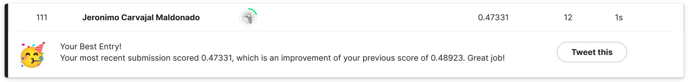

# store_sales_forecasting <!-- omit from toc --> 

Learning time series forecasting with the [Store Sales Kaggle competition](https://www.kaggle.com/competitions/store-sales-time-series-forecasting/overview): use time-series forecasting to forecast store sales on data from Corporación Favorita, a large Ecuadorian-based grocery retailer.

- [Introduction](#introduction)
  - [The data](#the-data)
- [First round of models](#first-round-of-models)
  - [Baseline](#baseline)
  - [Prophet model](#prophet-model)
  - [XGBoost Model](#xgboost-model)
  - [Ensemble model](#ensemble-model)
- [Second round of models](#second-round-of-models)
- [Final submission](#final-submission)

# Introduction

I joined this competition to improve my understanding on time series forecasting. This readme has the purpose of describing the most important parts of what I did on my learning journey.

## The data 

For the challenge, we have a set of stores and families of products, and we need to make a daily forecast of sales for each store and family for the next 15 days. Some external information, like the daily oil price and several holidays in Ecuador, are provided to be used as additional features for modelling.

One of the most challenging aspects of forecasting multiple instances for me is that there are many things going on: not all the stores are selling the same families of products, some are older than others, they have different sizes, sell different volumes, each family has different seasonalities, etc. So, it is hard to get a good overview before modelling. However, I did not know about this hardship before starting the challenge.

# First round of models

My first models were by store and family. Since I have several years of information, I decided to use two years of data and fairly complicated models, however the first thing I did was to set up a simple baseline.

## Baseline

This was a very simple model by store and family. It used the last 15 days of data to predict the upcoming 15 days. This model put me in the bottom 10% (707th) of the nearly 900 participants with a Root Mean Squared Logarithmic Error of 0.61922.

## Prophet model

The Prophet model is a type of GAM developed by reasearchers at Facebook specifically for time series forecasting. It is able to capture trend, seasonality at different aggregation levels, e.g., daily, yearly, and allows to add additional regressors. I thought this would be a great model because many families show important seasonal effects, so by adding the holidays as an additional regressor would probably boost the model's performanance. This is a fairly complicated model, but it yielded nearly no improvement on the super simple baseline, the test RMSLE was 0.61887.

## XGBoost Model

This model is a _classic_ regressor implementing fit/predict methods. For this model, I constructed some autoregressive features, i.e., using the past X days of sales as regressors, as well as other features related to the date, like day of week, month and year, which should be able to capture some additional trends on the data. Then, I fitted the XGBoost model by store and family. The issue here, is that usually, the best autorregressive features are previous day sales, or same day from previous week sales, and this is something that we don't have for all the instances in the test set. I think that partly for this reason, the test score was not very promising, at 0.72278, even higher than our simple baseline model.

## Ensemble model

In the end of this stage, I decided to use a simple mean of the three models above. Since the models have different underlying mechanisms, e.g., the prophet model uses the full time-series and maximum a posteriori estimation, while XGBoost optimizes an objective function via gradient boosting using some set of features, their predictions should be fairly unrelated. This means that their combined predictions might be useful in cancelling the random noise within the data, and boosting the real signal. This assumption was correctin this case, yielding a test error of 0.48923. Which is already on the top 50% of the 866 participants, at position 398.

# Second round of models

The idea here was to set up the data in matrix form as day/store for each family. Then use SVD as a preprocessing step to pool data across stores. The idea here is to use a low-rank approximation of the original data, which is likely to reduce the noise due to the fact that the most important eigenvalues from the SVD should be related to the actual signal in the data, so it is used as a sort of denoising technique.

This model used Prophet with weekly seasonality on a grouped time series of all the stores.

# Final submission

The final model used a simple mean of all the models above.

I'm happy with the final result: 111th from the 605 participants, which is on the top 20%.